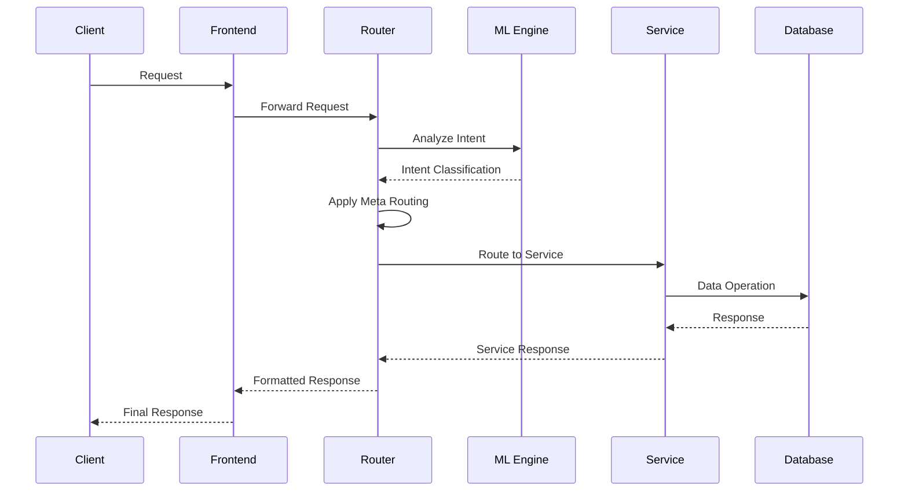

# Intelligent Intent Recognition Router Architecture

## システム概要

このシステムは、AI駆動のインテントレコグニションとメタルーティング機能を持つインテリジェントルーターです。ユーザーのリクエストを解析し、適切なCloud Runサービスに自動的にルーティングします。

## アーキテクチャ図

```
┌─────────────────────────────────────────────────────────────────────┐
│                           Client Layer                               │
├─────────────────────────────────────────────────────────────────────┤
│                                                                       │
│  ┌──────────────┐    ┌──────────────┐    ┌──────────────┐          │
│  │   Browser    │    │  Mobile App  │    │   API Client │          │
│  └──────┬───────┘    └──────┬───────┘    └──────┬───────┘          │
│         │                    │                    │                   │
│         └────────────────────┴────────────────────┘                  │
│                              │                                        │
└──────────────────────────────┼────────────────────────────────────────┘
                               │ HTTPS/WebSocket
                               ▼
┌─────────────────────────────────────────────────────────────────────┐
│                      Frontend Layer (Next.js)                        │
├─────────────────────────────────────────────────────────────────────┤
│                                                                       │
│  ┌────────────────────────────────────────────────────────────┐     │
│  │                    Next.js Application                      │     │
│  │  ┌──────────┐  ┌──────────┐  ┌──────────┐  ┌──────────┐  │     │
│  │  │  Router   │  │Monitoring│  │Analytics │  │   Admin   │  │     │
│  │  │   View    │  │Dashboard │  │   View   │  │  Console  │  │     │
│  │  └──────────┘  └──────────┘  └──────────┘  └──────────┘  │     │
│  └────────────────────────────────────────────────────────────┘     │
│                                                                       │
└──────────────────────────────┼────────────────────────────────────────┘
                               │ REST API/GraphQL
                               ▼
┌─────────────────────────────────────────────────────────────────────┐
│              Intent Recognition Router (Cloud Run)                   │
├─────────────────────────────────────────────────────────────────────┤
│                                                                       │
│  ┌─────────────────────────────────────────────────────────────┐    │
│  │                 Intent Recognition Engine                    │    │
│  │  ┌──────────┐  ┌──────────┐  ┌──────────┐  ┌──────────┐   │    │
│  │  │   NLP    │  │    ML    │  │  Pattern │  │   Rule   │   │    │
│  │  │ Analyzer │  │  Models  │  │ Matching │  │  Engine  │   │    │
│  │  └──────────┘  └──────────┘  └──────────┘  └──────────┘   │    │
│  └─────────────────────────────────────────────────────────────┘    │
│                                                                       │
│  ┌─────────────────────────────────────────────────────────────┐    │
│  │                    Meta Routing Engine                       │    │
│  │  ┌──────────┐  ┌──────────┐  ┌──────────┐  ┌──────────┐   │    │
│  │  │Contextual│  │   Load   │  │  Circuit │  │   Cache  │   │    │
│  │  │ Factors  │  │ Balancer │  │  Breaker │  │  Manager │   │    │
│  │  └──────────┘  └──────────┘  └──────────┘  └──────────┘   │    │
│  └─────────────────────────────────────────────────────────────┘    │
│                                                                       │
└──────────────────────────────┼────────────────────────────────────────┘
                               │ HTTP/gRPC
                               ▼
┌─────────────────────────────────────────────────────────────────────┐
│                    Microservices Layer (Cloud Run)                   │
├─────────────────────────────────────────────────────────────────────┤
│                                                                       │
│  ┌──────────────┐  ┌──────────────┐  ┌──────────────┐              │
│  │   Auth       │  │   Payment    │  │    Email     │              │
│  │  Service     │  │   Service    │  │   Service    │              │
│  └──────────────┘  └──────────────┘  └──────────────┘              │
│                                                                       │
│  ┌──────────────┐  ┌──────────────┐  ┌──────────────┐              │
│  │   Image      │  │  Analytics   │  │     PDF      │              │
│  │  Service     │  │   Service    │  │   Service    │              │
│  └──────────────┘  └──────────────┘  └──────────────┘              │
│                                                                       │
│  ┌──────────────┐  ┌──────────────┐  ┌──────────────┐              │
│  │  WebSocket   │  │      ML      │  │    Batch     │              │
│  │   Service    │  │   Service    │  │   Service    │              │
│  └──────────────┘  └──────────────┘  └──────────────┘              │
│                                                                       │
└──────────────────────────────┼────────────────────────────────────────┘
                               │
                               ▼
┌─────────────────────────────────────────────────────────────────────┐
│                         Data Layer                                   │
├─────────────────────────────────────────────────────────────────────┤
│                                                                       │
│  ┌──────────────┐  ┌──────────────┐  ┌──────────────┐              │
│  │    Redis     │  │   BigQuery   │  │   Firestore  │              │
│  │   (Cache)    │  │  (Analytics) │  │  (NoSQL DB)  │              │
│  └──────────────┘  └──────────────┘  └──────────────┘              │
│                                                                       │
│  ┌──────────────┐  ┌──────────────┐  ┌──────────────┐              │
│  │  Cloud SQL   │  │    Cloud     │  │   Pub/Sub    │              │
│  │   (RDBMS)    │  │   Storage    │  │  (Messaging) │              │
│  └──────────────┘  └──────────────┘  └──────────────┘              │
│                                                                       │
└───────────────────────────────────────────────────────────────────────┘
```

## コンポーネント説明

### 1. Intent Recognition Router
インテリジェントルーターの中核コンポーネント。以下の機能を提供：

- **NLP Analyzer**: 自然言語処理によるインテント解析
- **ML Models**: 機械学習モデルによる分類
- **Pattern Matching**: パターンマッチングによるルーティング
- **Rule Engine**: ルールベースのルーティング決定

### 2. Meta Routing Engine
高度なルーティング戦略を実装：

- **Contextual Factors**: ユーザープロファイル、時間、地理的位置などの文脈要因
- **Load Balancer**: 負荷分散アルゴリズム
- **Circuit Breaker**: 障害時の自動フェイルオーバー
- **Cache Manager**: レスポンスキャッシング

### 3. Microservices

10個の専門化されたCloud Runサービス：

1. **User Authentication Service**: 認証・認可
2. **Payment Processing Service**: 決済処理
3. **Email Notification Service**: メール通知
4. **Image Processing Service**: 画像処理
5. **Data Analytics Service**: データ分析
6. **PDF Generator Service**: PDF生成
7. **WebSocket Chat Service**: リアルタイム通信
8. **ML Inference Service**: 機械学習推論
9. **Scheduled Batch Processor**: バッチ処理
10. **API Gateway Service**: フォールバックゲートウェイ

## データフロー



## ルーティング決定プロセス

1. **インテント認識**
   - テキスト解析
   - パターンマッチング
   - MLモデル推論

2. **スコアリング**
   - 各サービスの適合度スコア計算
   - コンテキスト要因の重み付け

3. **ルーティング決定**
   - 最高スコアのサービス選択
   - フォールバック戦略の適用

4. **実行**
   - サーキットブレーカーチェック
   - リトライロジック
   - レスポンスキャッシング

## セキュリティ

- **認証**: OAuth 2.0 / JWT
- **認可**: RBAC (Role-Based Access Control)
- **暗号化**: TLS 1.3
- **監査**: 全リクエストのロギング

## モニタリング

- **メトリクス**: Prometheus形式
- **トレーシング**: OpenTelemetry
- **ロギング**: 構造化JSON形式
- **アラート**: 閾値ベースのアラート

## スケーラビリティ

- **水平スケーリング**: Cloud Runの自動スケーリング
- **キャッシング**: Redis分散キャッシュ
- **CDN**: Cloud CDN統合
- **負荷分散**: Global Load Balancer

## 開発環境セットアップ

```bash
# バックエンド起動
cd apps/intent-router
npm install
npm run dev

# フロントエンド起動
cd apps/frontend
npm install
npm run dev
```

## デプロイメント

```bash
# Cloud Runへのデプロイ
gcloud run deploy intent-recognition-router \
  --source . \
  --region asia-northeast1 \
  --allow-unauthenticated
```

## 設定ファイル

- `/deploy/manifests/config/meta-routing.json`: メタルーティング設定
- `/deploy/manifests/config/routing-rules.json`: ルーティングルール
- `/deploy/manifests/router/`: ルーターサービスマニフェスト
- `/deploy/manifests/services/`: 各マイクロサービスマニフェスト