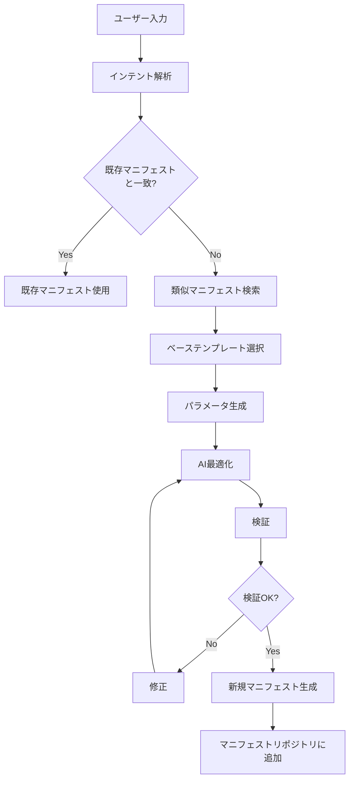

# Intelligent Manifest Generator 設計書

## 概要

スクリーンショットに基づいて、新しいターゲット（点線の円）に対して自動的に最適なCloud Runマニフェストを生成するインテリジェントジェネレーターシステムの設計です。

## システムアーキテクチャ

```
┌──────────────────────────────────────────────────────────────────────┐
│                    Intelligent Manifest Generator                     │
├──────────────────────────────────────────────────────────────────────┤
│                                                                        │
│  ┌─────────────────────────────────────────────────────────────┐     │
│  │                    Input Analysis Layer                      │     │
│  │  ┌────────────┐  ┌────────────┐  ┌────────────┐           │     │
│  │  │   Intent   │  │  Context   │  │ Similarity │           │     │
│  │  │  Analyzer  │  │  Extractor │  │   Finder   │           │     │
│  │  └────────────┘  └────────────┘  └────────────┘           │     │
│  └─────────────────────────────────────────────────────────────┘     │
│                                                                        │
│  ┌─────────────────────────────────────────────────────────────┐     │
│  │                  Manifest Repository Layer                   │     │
│  │  ┌────────────────────────────────────────────────────┐    │     │
│  │  │         Existing Manifests (Gray Circles)          │    │     │
│  │  │  ┌──────┐ ┌──────┐ ┌──────┐ ┌──────┐ ┌──────┐   │    │     │
│  │  │  │Auth  │ │Pay   │ │Email │ │Image │ │Analyt│   │    │     │
│  │  │  └──────┘ └──────┘ └──────┘ └──────┘ └──────┘   │    │     │
│  │  │  ┌──────┐ ┌──────┐ ┌──────┐ ┌──────┐ ┌──────┐   │    │     │
│  │  │  │PDF   │ │WS    │ │ML    │ │Batch │ │API GW│   │    │     │
│  │  │  └──────┘ └──────┘ └──────┘ └──────┘ └──────┘   │    │     │
│  │  └────────────────────────────────────────────────────┘    │     │
│  └─────────────────────────────────────────────────────────────┘     │
│                                                                        │
│  ┌─────────────────────────────────────────────────────────────┐     │
│  │                    AI Generation Engine                      │     │
│  │  ┌────────────┐  ┌────────────┐  ┌────────────┐           │     │
│  │  │  Template  │  │ Parameter  │  │  Service   │           │     │
│  │  │  Selector  │  │ Optimizer  │  │ Composer   │           │     │
│  │  └────────────┘  └────────────┘  └────────────┘           │     │
│  └─────────────────────────────────────────────────────────────┘     │
│                                                                        │
│  ┌─────────────────────────────────────────────────────────────┐     │
│  │                    Validation & Optimization                 │     │
│  │  ┌────────────┐  ┌────────────┐  ┌────────────┐           │     │
│  │  │   Schema   │  │ Performance│  │  Security  │           │     │
│  │  │ Validator  │  │  Optimizer │  │  Checker   │           │     │
│  │  └────────────┘  └────────────┘  └────────────┘           │     │
│  └─────────────────────────────────────────────────────────────┘     │
│                                                                        │
└──────────────────────────────────────────────────────────────────────┘
```

## 主要コンポーネント

### 1. Input Analysis Layer (入力解析層)

#### Intent Analyzer
- ユーザー入力からサービスの目的を理解
- NLPを使用してキーワード抽出
- サービスカテゴリの自動分類

#### Context Extractor
- 技術スタックの識別
- 依存関係の検出
- パフォーマンス要件の推定

#### Similarity Finder
- 既存マニフェストとの類似度計算
- 最も近い参照マニフェストの特定
- 重複チェック

### 2. Manifest Repository Layer (マニフェストリポジトリ層)

既存の10個のマニフェスト（グレーの円）を管理：
- 各マニフェストのメタデータ
- パターンとベストプラクティス
- 設定テンプレート

### 3. AI Generation Engine (AI生成エンジン)

#### Template Selector
- 最適な基本テンプレートの選択
- 複数テンプレートの組み合わせ
- カスタムテンプレートの生成

#### Parameter Optimizer
- リソース割り当ての最適化
- スケーリング設定の調整
- タイムアウト値の計算

#### Service Composer
- 環境変数の自動設定
- ヘルスチェックの構成
- ネットワーク設定の生成

### 4. Validation & Optimization (検証・最適化)

#### Schema Validator
- Cloud Run仕様への準拠確認
- 必須フィールドのチェック
- 構文エラーの検出

#### Performance Optimizer
- リソース使用効率の最適化
- コスト最適化の提案
- パフォーマンス予測

#### Security Checker
- セキュリティベストプラクティスの適用
- 脆弱性チェック
- アクセス制御の検証

## 生成プロセスフロー



## 入力仕様

```typescript
interface ManifestGenerationRequest {
  // 必須フィールド
  serviceName: string           // サービス名
  description: string           // サービスの説明

  // オプションフィールド
  intent?: string              // ユーザーの意図（自然言語）
  requirements?: {
    language?: string          // プログラミング言語
    framework?: string         // フレームワーク
    dependencies?: string[]    // 依存関係
    performance?: {
      expectedRPS?: number     // 期待されるRPS
      responseTime?: number    // レスポンスタイム要件
    }
    resources?: {
      cpu?: string            // CPU要件
      memory?: string         // メモリ要件
      gpu?: boolean          // GPU必要性
    }
    integration?: {
      databases?: string[]    // データベース接続
      apis?: string[]        // API連携
      messaging?: string[]   // メッセージングシステム
    }
  }

  // 参照情報
  similarTo?: string[]         // 類似サービス名
  baseTemplate?: string        // ベーステンプレート指定
}
```

## 出力仕様

```yaml
# 自動生成されるマニフェスト例
apiVersion: serving.knative.dev/v1
kind: Service
metadata:
  name: ${generated-service-name}
  namespace: default
  annotations:
    # AI生成メタデータ
    generated-by: "intelligent-manifest-generator"
    generation-version: "v1.0.0"
    generation-date: "${timestamp}"
    confidence-score: "${confidence}"
    base-template: "${template-name}"

spec:
  template:
    metadata:
      annotations:
        # 自動計算されたスケーリング設定
        autoscaling.knative.dev/minScale: "${calculated-min}"
        autoscaling.knative.dev/maxScale: "${calculated-max}"

    spec:
      # AI最適化されたリソース設定
      containers:
      - image: gcr.io/project-id/${service-name}:${version}
        resources:
          limits:
            cpu: "${optimized-cpu}"
            memory: "${optimized-memory}"
          requests:
            cpu: "${baseline-cpu}"
            memory: "${baseline-memory}"

        # 自動生成された環境変数
        env: ${generated-env-vars}

        # インテリジェントヘルスチェック
        livenessProbe: ${generated-probe}
        readinessProbe: ${generated-probe}
```

## 機械学習モデル

### 1. Intent Classification Model
- **アーキテクチャ**: BERT-based transformer
- **トレーニングデータ**: 既存マニフェスト + サービス説明
- **出力**: サービスカテゴリ確率分布

### 2. Parameter Prediction Model
- **アーキテクチャ**: Random Forest + XGBoost
- **特徴量**:
  - サービスタイプ
  - 技術スタック
  - 予想負荷
- **出力**: 最適リソース設定

### 3. Similarity Matching Model
- **アーキテクチャ**: Sentence-BERT
- **ベクトル空間**: 512次元
- **類似度メトリック**: コサイン類似度

## 実装例

```typescript
// apps/manifest-generator/src/ManifestGenerator.ts

export class IntelligentManifestGenerator {
  private intentClassifier: IntentClassifier
  private templateEngine: TemplateEngine
  private optimizer: ManifestOptimizer
  private validator: ManifestValidator

  async generateManifest(request: ManifestGenerationRequest): Promise<GeneratedManifest> {
    // 1. インテント解析
    const intent = await this.intentClassifier.classify(request)

    // 2. 類似マニフェスト検索
    const similarManifests = await this.findSimilarManifests(intent)

    // 3. 既存マニフェストチェック
    if (this.isExactMatch(intent, similarManifests)) {
      return this.useExistingManifest(similarManifests[0])
    }

    // 4. ベーステンプレート選択
    const template = await this.templateEngine.selectTemplate(
      intent,
      similarManifests,
      request.baseTemplate
    )

    // 5. パラメータ生成
    const parameters = await this.generateParameters(request, template)

    // 6. マニフェスト構築
    const manifest = await this.buildManifest(template, parameters)

    // 7. AI最適化
    const optimized = await this.optimizer.optimize(manifest, request.requirements)

    // 8. 検証
    const validation = await this.validator.validate(optimized)

    if (!validation.isValid) {
      return this.handleValidationErrors(validation, optimized)
    }

    // 9. リポジトリに追加
    await this.addToRepository(optimized)

    return {
      manifest: optimized,
      metadata: {
        generatedAt: new Date(),
        confidence: this.calculateConfidence(intent, similarManifests),
        baseTemplate: template.name,
        optimizations: this.optimizer.getAppliedOptimizations()
      }
    }
  }

  private async findSimilarManifests(intent: Intent): Promise<Manifest[]> {
    // ベクトル類似度検索
    const embeddings = await this.getEmbeddings(intent)
    return this.vectorSearch(embeddings, topK = 3)
  }

  private async generateParameters(
    request: ManifestGenerationRequest,
    template: Template
  ): Promise<ManifestParameters> {
    const ml_predictions = await this.predictParameters(request)

    return {
      scaling: {
        min: ml_predictions.minScale || 0,
        max: ml_predictions.maxScale || 100,
        concurrency: ml_predictions.concurrency || 1000
      },
      resources: {
        cpu: this.selectCPU(request.requirements?.resources?.cpu, ml_predictions.cpu),
        memory: this.selectMemory(request.requirements?.resources?.memory, ml_predictions.memory)
      },
      environment: await this.generateEnvironmentVariables(request),
      networking: await this.generateNetworkConfig(request),
      monitoring: await this.generateMonitoringConfig(request)
    }
  }
}
```

## モニタリングとフィードバック

### メトリクス
- 生成成功率
- 平均生成時間
- テンプレート使用頻度
- 最適化による改善度

### フィードバックループ
- ユーザーによる生成結果の評価
- 実運用でのパフォーマンス追跡
- モデルの継続的改善

## セキュリティ考慮事項

1. **入力検証**
   - SQLインジェクション防止
   - XSS対策
   - パス・トラバーサル防止

2. **生成マニフェストのセキュリティ**
   - 最小権限原則の適用
   - シークレット管理の自動化
   - ネットワークポリシーの適用

3. **監査ログ**
   - 全生成履歴の記録
   - 変更追跡
   - アクセス制御

## 拡張性

### プラグインシステム
- カスタムテンプレート
- 独自最適化ルール
- 外部サービス連携

### マルチクラウド対応
- AWS ECS/Fargate
- Azure Container Instances
- Kubernetes

## 今後の拡張計画

1. **Phase 1**: 基本的な自動生成
2. **Phase 2**: ML最適化の追加
3. **Phase 3**: マルチクラウド対応
4. **Phase 4**: 自己学習・改善機能